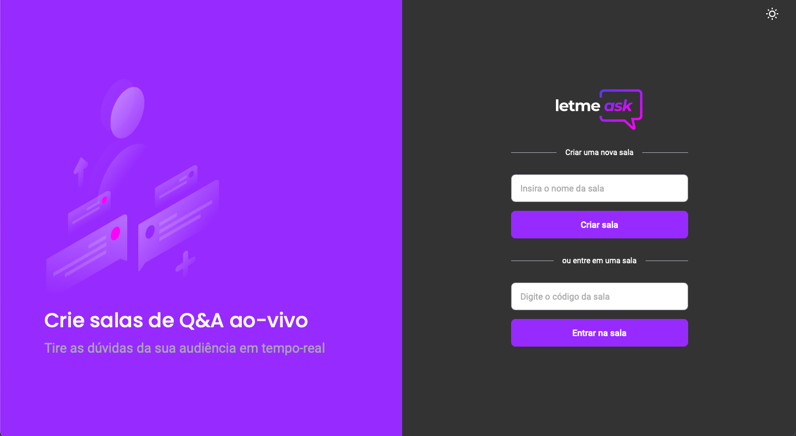
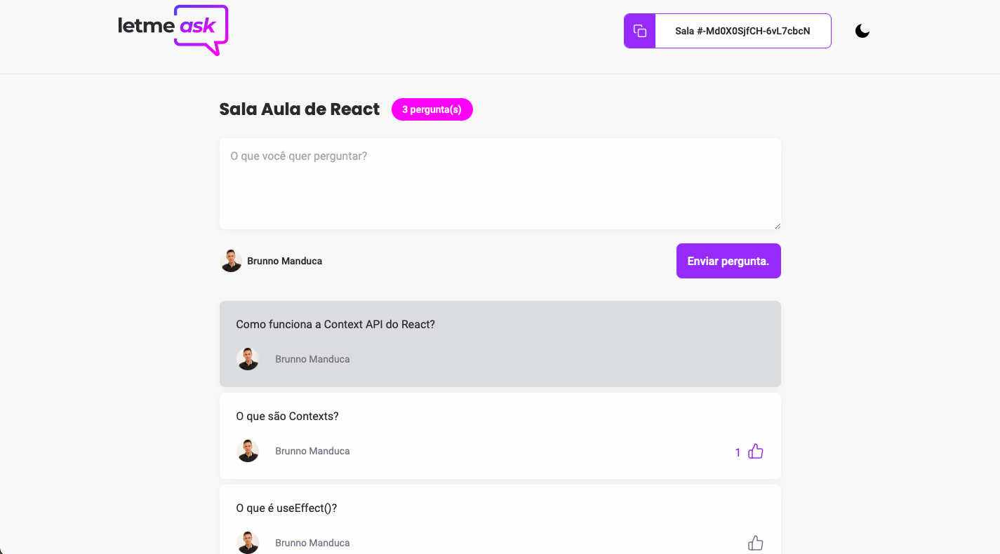
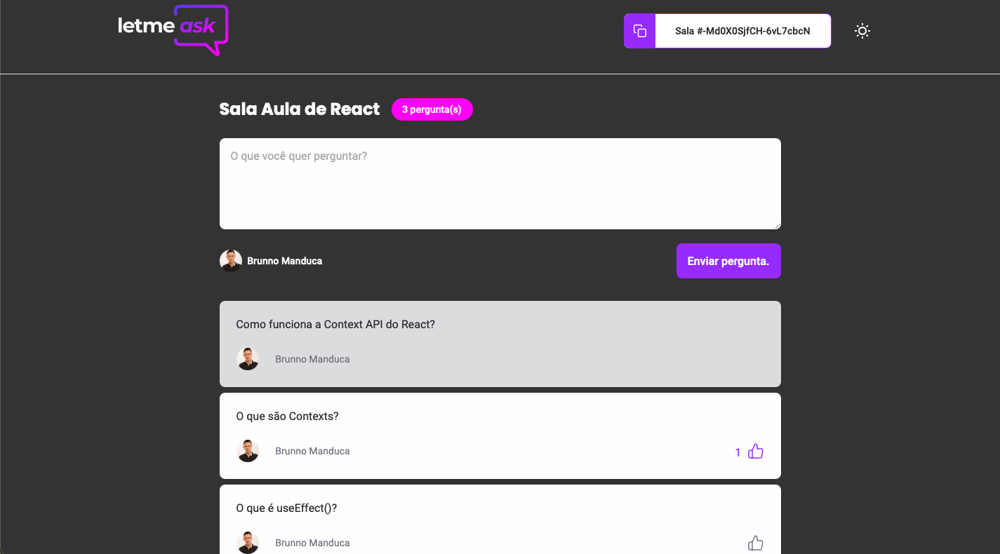
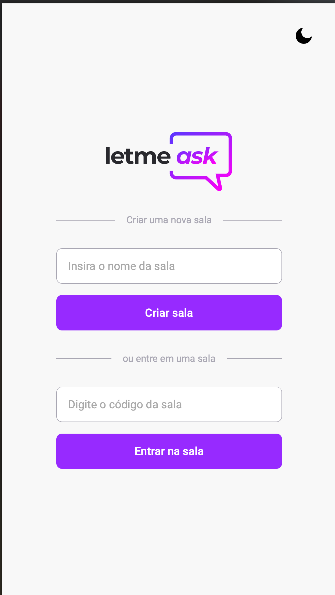

<p align="center">
  
</p>


## Súmario


* [Aplicação](#📲-aplicação)
* [Letmeask](#❓letmeask❗)
* [Tecnologias presentes na aplicação](#🖥-tecnologias-presentes-na-aplicação)
* [Layout da aplicação](#layout-da-aplicação)
* [Funcionalidades](#funcionalidades)
* [Desafios](#🆙-desafios)
* [Clone, instalação e uso da aplicação](#🚀-clone-instalação-e-uso-da-aplicação)
* [Contribuindo com projeto](#contribuindo-com-projeto)
* [Informações](#📣-informações)
* [License](#license)
* [Contato](#📧-contato)


## 📲 Aplicação

* Aplicação Letmeask foi totalmente desenvolvida durante a [Next Level Week #6](https://nextlevelweek.com/pre-nlw) aplicada pela [Rocketseat](https://rocketseat.com.br/sobre)

* Letmeask foi desenvolvida com intuito de permitir a criação de salas de "Q&A in real time", ou seja, perguntas e respostas em tempo real.

* Perfeita para utilização em aulas online, para quem faz criação de conteúdo, eventos e até mesmo streams ao vivo

* Aplicação totalmente voltada para quem procura performance e agilidade

  

## ❓Letmeask❗

* Acessar a página da aplicação  =>  👾 [Letmeask](https://letmeask-8ff68.web.app)
  

* Home

  

  

* Home com tema aplicado

  

  

* 'Sala' criada para que possam fazer as perguntas

  

  
  

* 'Sala' criada para que possam fazer as perguntas com tema aplicado

  


* Home versão mobile

  

  

## 🖥 Tecnologias presentes na aplicação

* ReactJS 

* Typescript  

* Firebase  

* Styled-components

* React-hot-toast

   Para saber mais ou ter mais detalhes, só analisar o arquivo **[package.json](./package.json)**


## Layout da aplicação

* É possível verificar o layout da aplicação através do link -> [Layout Letmeask](https://www.figma.com/file/u0BQK8rCf2KgzcukdRRCWh/Letmeask/duplicate)

* Lembrando, que para acessar o layout, é preciso ter uma conta no [Figma](http://figma.com)


## Funcionalidades

- [x] Funcionalidades da aplicação
  - [x] Criação de salas
  - [x] Encerrar salas
  - [x] Acessar salas já criadas
  - [x] Adicionar novas perguntas
  - [x] Dar like em perguntas
  - [x] Dar destaque em perguntas (admin)
  - [x] Marcar perguntas como respondidas (admin)
  - [x] Remover perguntas (admin)


## 🆙 Desafios

- [ ] Documentação
  - [x] Criação de um Readme bem elaborado para o projeto
  - [x] Tecnologias e recursos utilizados no projeto
  - [x] Clone, instalação e utilização da aplicação
  - [x] Print da aplicação
  - [ ] GIF 
- [ ] Levando a aplicação para outro nível
  - [x] Responsividade
  - [x] Tema Dark
  - [x] Versão PWA
  - [ ] styled Components
  - [ ] ESLint e Prettier


## 🚀 Clone, instalação e uso da aplicação

* Como indicação, você precisará das seguintes ferramentas para iniciar
  * [Node.js](https://nodejs.org/pt-br/) (versão LTS)
  * [Yarn](https://classic.yarnpkg.com/en/docs/install/) (versão LTS)
  * [Git](https://git-scm.com)
  * Para edição e desenvolvimento, eu indico o [VSCode](https://code.visualstudio.com/)

```bash
# Efetuar clone deste repositório
$ (sudo) git clone https://github.com/BManduca/nlw6_letmeask_bm

# Acessar a pasta da aplicação, através do terminal
$ cd nlw6_letmeask_bm

# Efetuar a instalação das dependências, através do yarn ou do npm
$ (sudo) yarn ou npm run dev

# O servidor é iniciado através da porta -> 3000
# O acesso ficará da seguinte forma -> http://localhost:3000/

```


## Contribuindo com projeto

* Passo 01

  🍴Efetuar fork do repositório

* Passo 02

  👯 Efetuar clone do repositório para sua máquina local

  ```bash
  git clone 
  ```

* Passo 03

  🆕 Criar sua própria branch para aplicar suas alterações

  ```bash
  git checkout -b 'name-your-branch'
  ```

* Passo 04

  ✅ Efetuar commit das suas alterações

  ``` bash
  git commit -m 'comentário para marcar o seu commit através da sua branch'
  ```

* Passo 05

  📌 Efetuar push na sua branch 

  ``` bash
  git push origin 'name-your-branch'
  ```

* Passo 06

  🔁 Criar novo pull request


## 📣 Informações

* Para uma maior segurança com relação aos dados gerados no firebase, tem como sugestão, efetuar a criação de um arquivo .env.local, por exemplo, na raiz da aplicação, pode seguir como exemplo o arquivo .env.example que eu deixei da raiz do projeto e assim armazenar as suas configurações, após a criação do aplicativo no firebase
* É necessário a criação de uma conta no Firebase e um projeto para ter a sua disposição um Realtime Database
* As informações do arquivo .env.local ficará da seguinte forma, sendo preenchido com as informações geradas após criar o aplicativo la no firebase, como comentado acima

```latex
# All this information is provided when the application is created in firebase
REACT_APP_API_KEY=
REACT_APP_AUTH_DOMAIN=
REACT_APP_DATABASE_URL=
REACT_APP_PROJECT_ID=
REACT_APP_STORAGE_BUCKET=
REACT_APP_MESSAGING_SENDER_ID=
REACT_APP_APP_ID=
```


## License

This project is under the MIT license. See the [LICENSE](LICENSE.md) file  for more details.

## 📧 Contato

[](mailto:brunnomanducarfe@gmail.com) [](https://www.linkedin.com/in/brunno-manduca-b97080118/) 


